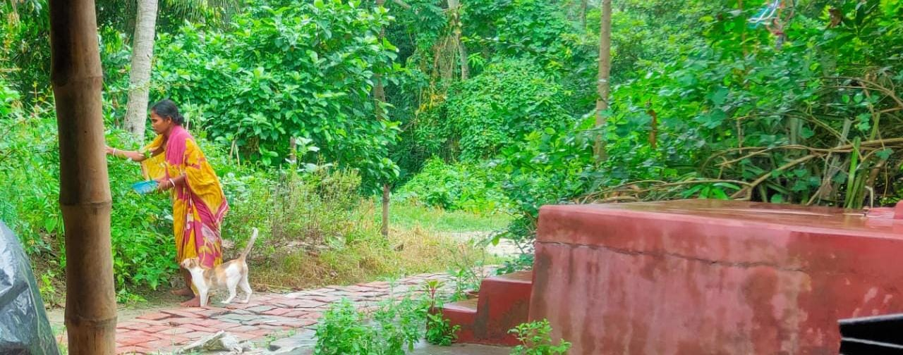

# Hi 👋, I'm Avoy Jana

# My web is https://avoyjana.github.io/Academic-Profile/
## Education 🎓
- **Master of Science (MSc) in Physics**, Indian Institute of Technology (IIT Delhi) 🏛️ (2023-2025)
- **Bachelor of Science (BSc) in Physics Honours**, Panskura Banamali College, Vidyasagar University 🏫 (2019-2022)

## Technical Skills 🛠️

### Programming Languages
- **Python**: 🔵 🔵 🔵 🔵 🔵
- **Java**: 🔵 🔵  ⚪ ⚪ ⚪
- **Mathematica**: 🔵 🔵 🔵 ⚪ ⚪
- **Matlab**: 🔵 🔵 🔵 ⚪ ⚪
- **HTML/CSS**: 🔵 🔵 🔵 🔵 ⚪
- **LaTeX**: 🔵 🔵 🔵 🔵 🔵

### Operating Systems
- **Linux**: 🔵 🔵 🔵 ⚪ ⚪
- **Windows**: 🔵 🔵 🔵 🔵 ⚪

### Software
- **Visualization/Simulation**: 🔵 🔵 🔵 🔵 ⚪  
  *(e.g., Matplotlib, Gnuplot, etc.)*
- **Data handling/analysis**: 🔵 🔵 🔵 🔵 🔵  
  *(e.g., NumPy, SciPy, etc.)*

### Tools
- **MS Office**: 🔵 🔵 🔵 🔵 ⚪
- **VS Code**: 🔵 🔵 🔵 🔵 🔵
- **Google Colab**: 🔵 🔵 🔵 🔵 🔵
- **Wolfram Engine**: 🔵 🔵 🔵 ⚪ ⚪
- **Anaconda**: 🔵 🔵 🔵 🔵 ⚪
- **GitHub**: 🔵 🔵 🔵 🔵 ⚪

## MSc Projects 🚧

